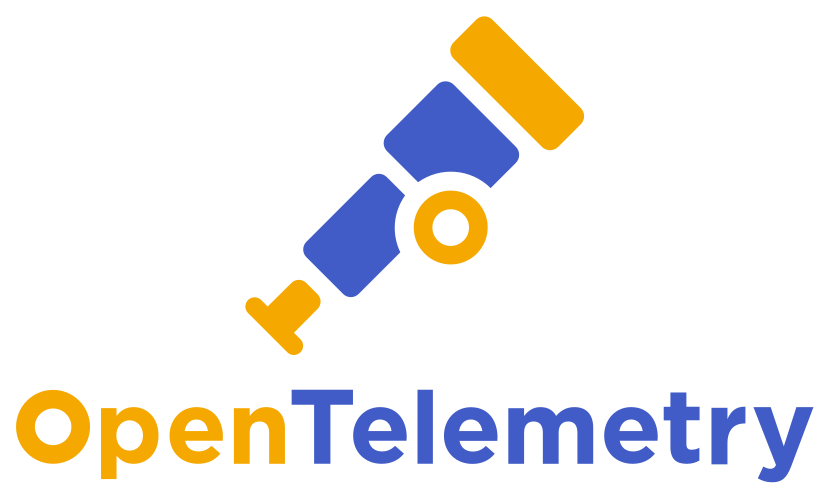

# k3s-cilium-o11y-stack 🔭 

<h3 align="center">
    Local-first, eBPF-powered, OpenTelemetry-native observability stack out of the box 📦
</h3>

<div align="center">
  <a href="https://opentelemetry.io/">
    
  </a>
  <a href="https://clickhouse.com/">
    <picture>
      <source media="(prefers-color-scheme: dark)" srcset="./img/logos/clickhouse-logo.svg">
      
    </picture>
  </a>
  <a href="https://grafana.com/oss/grafana/">
    
  </a>
  <br>
  <a href="https://cilium.io/">
    <picture>
      <source media="(prefers-color-scheme: dark)" srcset="./img/logos/cilium-logo.svg">
      
    </picture>
  </a>
  <a href="https://github.com/cilium/hubble">
    <picture>
      <source media="(prefers-color-scheme: dark)" srcset="./img/logos/hubble-logo.svg">
      
    </picture>
  </a>
  <a href="https://tailscale.com/">
    <picture>
      <source media="(prefers-color-scheme: dark)" srcset="./img/logos/tailscale-logo.svg">
      
    </picture>
  </a>
</div>

Kubernetes-backed observability normally arrives as a cloud bill and a vendor's
agent. This project runs the same industry-standard components on hardware you
own, so DevOps and SRE practitioners can see the whole pipeline, down to the
parts a vendor would keep hidden.

Linux only. eBPF wants a real kernel, and on macOS Docker runs inside a VM where
this does not hold up.

## Quick start

Prerequisites and the full walkthrough live in [SETUP.md](SETUP.md). The short
version, run once on the host in this order:

```bash
make setup            # check for helm, mkcert, envsubst
make k3s-install      # k3s with flannel, kube-proxy and traefik disabled
make cilium-install   # Cilium CNI + Hubble
make cilium-lb        # LoadBalancer IP pool + L2 announcements
make gateway-install  # Envoy Gateway controller
make tls-install      # mkcert wildcard cert
make gateway-apply    # GatewayClass + cluster-ingress Gateway
make o11y-install     # ClickHouse, Prometheus, OTel Collector, Grafana
```

Then verify, and add either optional piece:

```bash
make o11y-status         # confirm the stack came up
make tailscale-install   # optional: remote access over your tailnet
make otel-demo-install   # optional: a workload that produces real telemetry
```

`make help` prints every target alongside the resolved value of each variable.

## Components

| Component | Layer | Role | Access |
|-----------|-------|------|--------|
| [k3s](https://k3s.io) | Cluster | Lightweight Kubernetes, with flannel, kube-proxy, and Traefik disabled to make room for Cilium + Envoy Gateway | internal |
| [Cilium](https://cilium.io) | Networking | eBPF CNI: pod networking, kube-proxy replacement, L2 LoadBalancer IP pool | internal |
| [Hubble UI](https://docs.cilium.io/en/stable/gettingstarted/hubble/) | Networking | Real-time network flow visualization built into Cilium | `hubble.<domain>` |
| [Envoy Gateway](https://gateway.envoyproxy.io) | Ingress | Gateway API controller; routes HTTPS subdomains to in-cluster services | internal |
| [mkcert](https://github.com/FiloSottile/mkcert) | TLS | [@FiloSottile](https://github.com/FiloSottile)'s tool for bringing HTTPS to `localhost` | setup CLI |
| [Prometheus](https://prometheus.io) | Observability | Time-series store for infra metrics; backs the Cilium dashboards | internal |
| [OTel Collector](https://opentelemetry.io/docs/collector/) | Observability | Receives OTLP into ClickHouse; scrapes Cilium/Hubble/host into Prometheus | `:4317/:4318` |
| [node-exporter](https://github.com/prometheus/node_exporter) | Observability | Host metrics for the node itself: CPU, memory, disk, filesystem, network | internal |
| [ClickHouse](https://clickhouse.com) | Observability | OLAP store for logs, traces, and metrics, run by ClickHouse's [official Kubernetes operator](https://github.com/ClickHouse/clickhouse-operator) | internal |
| [Grafana](https://grafana.com) | Observability | Dashboards over Prometheus + ClickHouse | `grafana.<domain>` |
| [Tailscale Operator](https://tailscale.com/kb/1236/kubernetes-operator) | Remote access | *(optional)* Exposes services to your tailnet with auto-provisioned Let's Encrypt TLS | — |

Exposed services use host-based routing. TLS is an mkcert wildcard on the LAN
and auto-provisioned Let's Encrypt over Tailscale, where each service also
resolves at `<service>.<tailnet>.ts.net`. `<domain>` defaults to
`example.local`.

## Architecture

```
Ingress — reaching the UIs
  ┌───────────┐  mkcert TLS (LAN)
  │ LAN       │────────────────────▶ Envoy Gateway ──────┐
  └───────────┘                                          ├──▶ Grafana · Hubble UI
  ┌───────────┐  Let's Encrypt (Tailscale)               │
  │ Tailscale │────────────────────▶ Tailscale Operator ─┘
  └───────────┘

Data plane — how telemetry flows
                       ┌────────────────┐
  apps ──── OTLP ─────▶│ OTel Collector │──▶ ClickHouse ──┐
                       └────────────────┘                 ├──▶ Grafana
   Cilium · Hubble ◀──── scrape ──┤                       │
                                  └──remote_write──▶ Prometheus
                                                          ▲
                     apiserver · nodes · cadvisor · node-exporter ┘
                     kube-state-metrics
```

Metrics land in two different stores, and querying the wrong one returns empty
panels instead of an error. [docs/telemetry.md](docs/telemetry.md) covers the
split, the span-derived RED metrics, and how to point your own service at the
collector.

## Documentation

| Doc | What's in it |
|-----|--------------|
| [SETUP.md](SETUP.md) | Prerequisites and the step-by-step bootstrap, including the Tailscale admin console steps |
| [docs/telemetry.md](docs/telemetry.md) | Which store holds which signal, RED metrics from spans, adding your own service, external OTLP ingest |
| [docs/otel-demo.md](docs/otel-demo.md) | The optional OpenTelemetry demo app, its dashboards, and its known rough edges |
| [docs/runbook.md](docs/runbook.md) | When things go wrong: triage, symptom-to-fix, and restoring a deleted component |
| [CONTRIBUTING.md](CONTRIBUTING.md) | Conventions for changing charts, values, and docs, and how to verify a change |
| [AGENT.md](AGENT.md) | Deploying the stack end to end from an AI coding agent |
| [k8s/tls/README.md](k8s/tls/README.md) | Trusting the mkcert CA on other devices |

## Why this stack

Every component was picked against the same criteria:

- Mature and open source, preferably part of the CNCF ecosystem
- Speaks OpenTelemetry, the de facto standard for observing systems
- Supports eBPF, increasingly the standard for instrumenting networks and applications
- Deploys local-first, so it is easy to run, observe, and modify on one machine
- Ships dashboards you can import and export from Grafana

The stack is opinionated: eBPF is the right way to observe and secure a network.
How it meshes with the traditional pillars of metrics, traces, and logs is still
an open question. Running Cilium as the CNI at least makes that question
answerable, because you can watch telemetry move across the network it travels
on instead of trusting that a black-box sidecar delivered your data to a vendor.

### Why not ClickStack, SigNoz, or an LGTM omnibus?

Cilium's Hubble UI already renders its network visualizations through Grafana
dashboards and Prometheus metrics. Given that, the stack with the fewest moving
parts was the one that kept Grafana and Prometheus. Every alternative needed
custom shims to reshape data into someone else's box.

Grafana and Hubble together give both halves: a vibrant catalog of Grafana
dashboards, plus network visualizations that ship with the CNI. Exposing
ClickHouse and Cilium directly also shows operators how telemetry actually
flows, which an all-in-one like SigNoz or Grafana's LGTM images keeps hidden by
design.

The foundation still comes from ClickStack. Its `clickstack` chart bundles
HyperDX, MongoDB, and a second OTel Collector on top of the [official ClickHouse
operator](https://github.com/ClickHouse/clickhouse-operator), and HyperDX cannot
be switched off. So we install that operator directly and declare the
`KeeperCluster` and `ClickHouseCluster` ourselves in
[`k8s/o11y/manifests/clickhouse-cluster.yaml`](k8s/o11y/manifests/clickhouse-cluster.yaml):
the same upstream ClickHouse, without the parts Grafana already covers.

## Trademarks

ClickHouse, the ClickHouse logo, and related marks are trademarks or registered
trademarks of ClickHouse, Inc. or its affiliates. This project is not affiliated
with or endorsed by ClickHouse, Inc.

Tailscale is a registered trademark of Tailscale Inc. This project is not
affiliated with or endorsed by Tailscale Inc.
